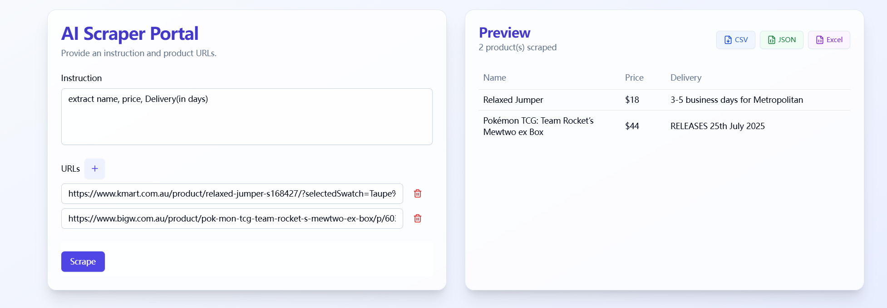
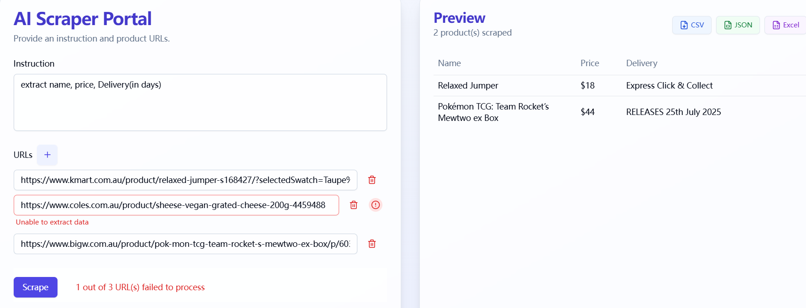

# SmartScrape Studio

SmartScrape Studio is an AI-powered web scraping API that extracts structured data from e-commerce websites. It uses OpenAI's GPT models to intelligently parse content and Selenium for handling dynamic websites.

Demo: https://smart-scrape-five.vercel.app/

⚠️ **Note on Budget Constraints**

Given the $50 budget for the AI Challenge, running a crawler-based application in the cloud (e.g., Render, Railway) can be quite challenging due to memory and timeout limitations.  
To ensure better performance and stability, I kindly suggest running the scraping component **locally**, if possible.


[🎥 Watch demo video](https://youtu.be/el4OY9WH6fg)
## Features

- **AI-Powered Extraction**: Uses GPT-4o to intelligently extract data from any e-commerce product page
- **Field Standardization**: Ensures consistent field names across different websites
- **Dynamic Content Support**: Handles JavaScript-rendered content with Selenium
- **Anti-Detection Measures**: Rotates user agents and supports proxies to avoid blocking
- **Parallel Processing**: Processes multiple URLs simultaneously for efficiency
- **Error Handling**: Provides detailed error reporting and graceful failure
- **Caching System**: Reduces redundant requests and improves performance

## Demo Screenshots

### Data Extraction Results


## Setup

### Backend Setup

1. Navigate to the data-portal directory:
```bash
cd data-portal
```

2. Install required dependencies:
```bash
pip install -r requirements.txt
```

3. Create a `.env` file with the following variables:
```
OPENAI_API_KEY=your_openai_api_key
FLASK_ENV=development
PORT=5000
```

4. Start the Flask server:
```bash
# Development mode
python app.py
```

The backend will run on http://localhost:5000 by default.

### Frontend Setup

1. Navigate to the ai-scraper directory:
```bash
cd ai-scraper
```

2. Install dependencies:
```bash
npm install
```

3. Start the development server:
```bash
npm run dev
```

The frontend will be available at http://localhost:5173.

## Usage

### API Endpoints

#### Batch Process URLs

```
POST /api/batch-process
```

**Request Body:**

```json
{
  "urls": [
    "https://www.example.com/product1",
    "https://www.example.com/product2"
  ],
  "prompt": "extract name, price, delivery options, and availability",
  "options": {
    "parallel": 3
  }
}
```

**Example Response:**

```json
{
  "success": true,
  "data": {
    "total": 2,
    "successful": 2,
    "failed": 0,
    "results": [
      {
        "url": "https://www.kmart.com.au/product/relaxed-jumper-s168427/?selectedSwatch=Taupe%20Mrl",
        "status": "success",
        "data": [
          {
            "name": "Relaxed Jumper",
            "price": "$18",
            "delivery": "Express Click & Collect and Free delivery"
          }
        ]
      },
      {
        "url": "https://www.bigw.com.au/product/pok-mon-tcg-team-rocket-s-mewtwo-ex-box/p/6030100",
        "status": "success",
        "data": [
          {
            "name": "Pokémon TCG: Team Rocket's Mewtwo ex Box",
            "price": "$44",
            "delivery_in_days": "RELEASES 25th July 2025"
          }
        ]
      }
    ],
    "metadata": {
      "processing_time_seconds": 5.21,
      "timestamp_utc": "2023-05-20T14:23:45Z",
      "required_fields": ["name", "price", "delivery", "delivery_in_days"]
    }
  }
}
```


## Anti-Scraping Considerations

**Important**: Avoid making multiple requests to the same website in a short period, especially for sites like Coles. E-commerce websites have sophisticated anti-scraping mechanisms that may:

- Temporarily block your IP address
- Present CAPTCHA challenges
- Rate-limit your access

For batch scraping, it's recommended to:
- Utilize the caching system to reduce duplicate requests
- Add random delays between requests
- Rotate IP addresses using proxy services
- Consider using the `PROXY_LIST` environment variable to specify proxy servers

## Example Test Cases

### Test Instructions
```
instruction: extract name, price, Delivery(in days)
```

### Test URLs
```
https://www.kmart.com.au/product/relaxed-jumper-s168427/?selectedSwatch=Taupe%20Mrl
https://www.bigw.com.au/product/pok-mon-tcg-team-rocket-s-mewtwo-ex-box/p/6030100
```

